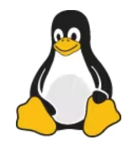

para hacer un titulo ponemos un #, para poner un subtitulo usamos dos # y tres #
# Titulo del manual
## Este seria el nivel 2 para el subtitulo
### Este seria el nivel 3 para crear un subtitulo
para poner negrita seria poner dos * seguidos antes y despues de la palabra en negrita

 **estas palabras estarian en negrita**

 para poner una frase en cursiva pondriamos un * a cada lado de la palabra

 *este seria el ejemplo de cursiva*

 Este **manual** te guiará en la elaboración de documentos *markdawn* de manera facil y rápida.

 para crear una lista sería poner los numeros de manera numerada seria poner los numeros antes. 

1. Primera cosa de la lista
2. Segunda cosa de la lista
3. Tercera cosa de la lista
4. Cuarta cosa de la lista

para crear listas de manera de viñeta es poniendo un - antes de la palabra

- Primera cosa
- Segunda cosa
- Tercera cosa
- Cuarta cosa 

para subir una foto debemos subirlo al repositorio y del repositorio a esto

para poder subir un enlace es poner un nombre entre [] y la url de la pagina entre parentesis
[coches.net](https://www.coches.net/).

para crear una cita tienes que poner > y luego escribrirlo

> este serria el ejemplo de cita

para crear tablas debemos usar el comando pipe o esto | para las barras vertical y - para separar celdas

| columna 1 | columna 2 | columna 3|
|-----------|-----------|----------|
| fila 1    |  celda 1  | celda 2  |
| fila 2    |  celda 3  | celda 4  |
